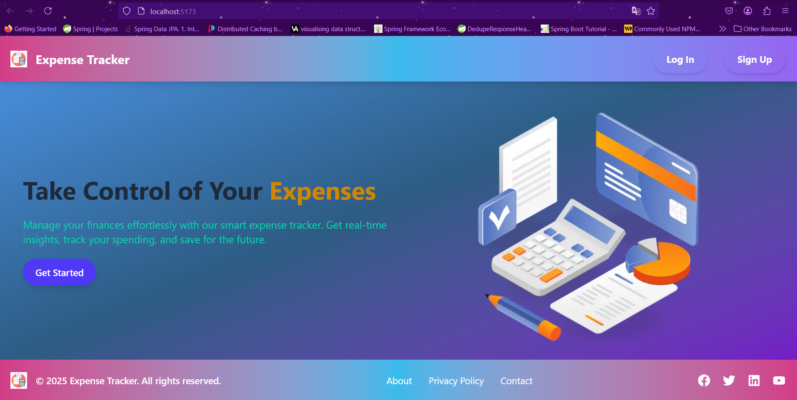
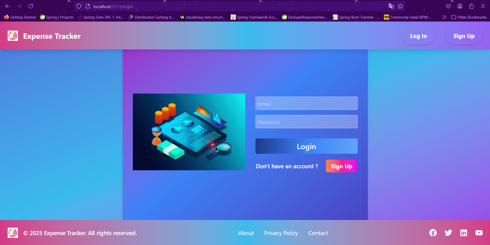
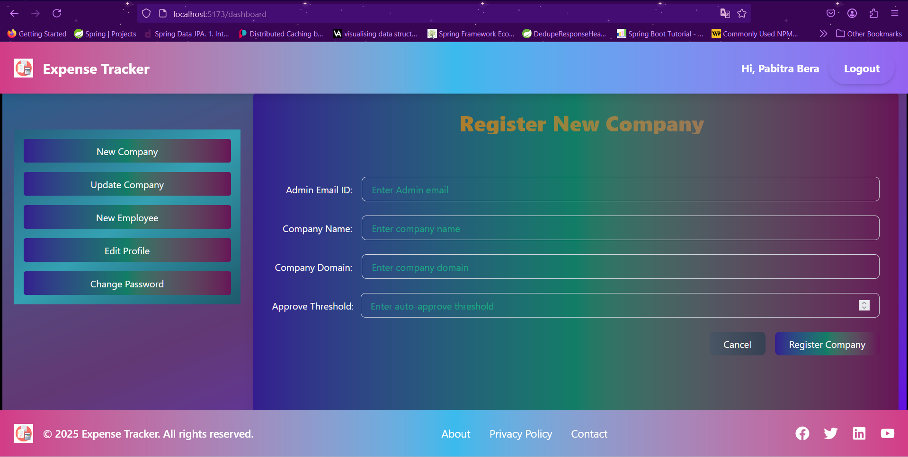
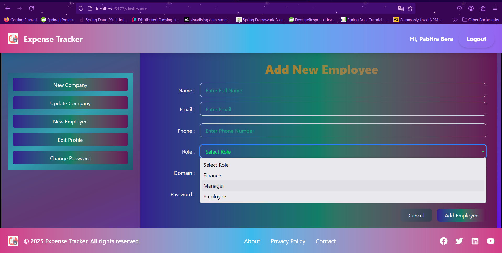
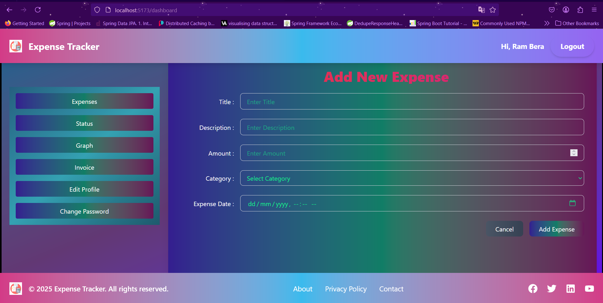
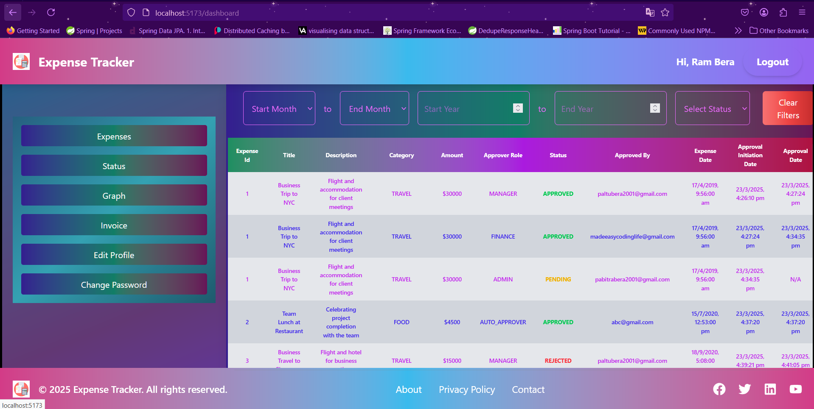
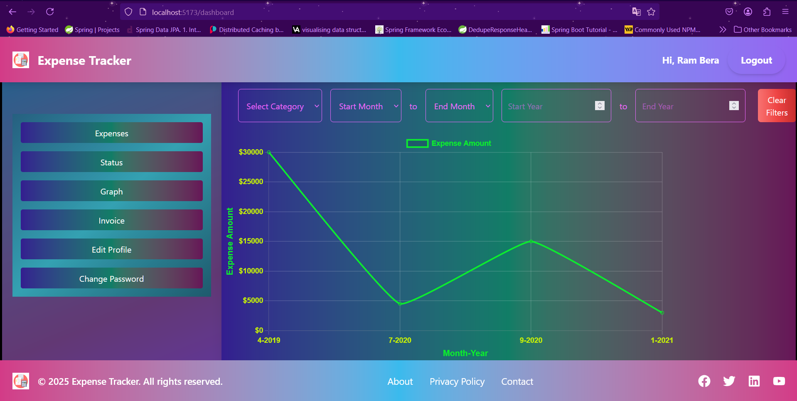
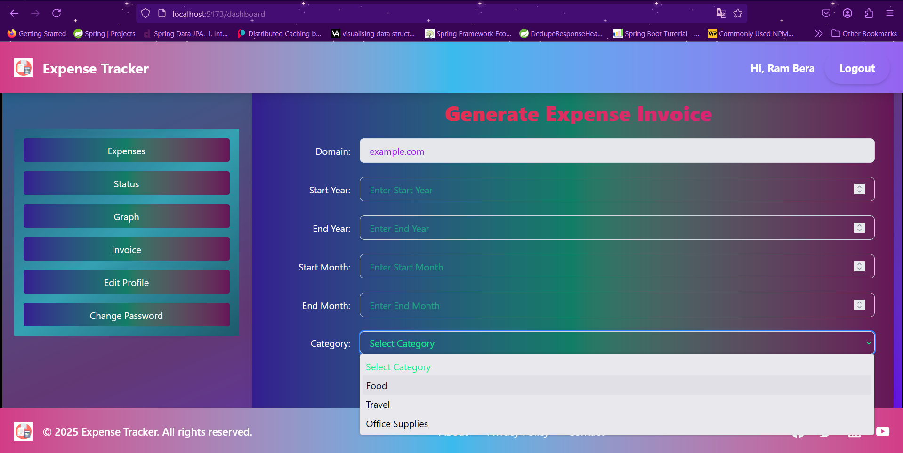
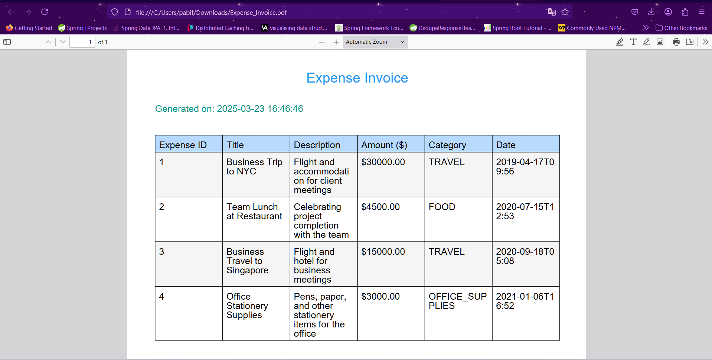

# Expense Management System 🚀

## Overview 📝

The Expense Management System is a **full-stack web application** that enables companies to efficiently manage their expenses, approvals, and financial tracking. Built with **Spring Boot microservices** for the backend and **React.js with Tailwind CSS** for the frontend, this system ensures **scalability, security, and performance**.

## Features 🌟

- **Authentication & Authorization 🔒** (JWT-based, Multi-company login/logout)
- **Company & Employee Management 👥** (Add, update, remove employees & assign roles)
- **Expense Tracking 💰** (Attach invoices, categorize expenses, track status)
- **Multi-Level Approval System ✅** (Manager , Finance & Admin approval workflows)
- **Real-time Notifications 📧** (Email notifications via the Notification Service)
- **Analytics & Reporting 📊** (Monthly, yearly expense trends, visual graphs)
- **Audit Logging 🛠️** (Track all actions performed by users)
- **Secure File Uploads 📁** (Attach invoices in PDF, image formats)
- **Role-based Access Control 🔑** (Manager, Employee, Finance & Admin roles)
- **Microservices Architecture 🏗️** (Scalable & modular services)

## Tech Stack ⚙️

### **[Backend](https://github.com/madeeasycodinglife/enterprise-expense-management-system.git)** 💻

- **Spring Boot ⚡** (Microservices architecture)
- **H2 DB 🗃️** (Relational database for secure storage)
- **Spring Security 🔐** (Authentication & Authorization)
- **Spring Data JPA 📊** (ORM for efficient database interactions)
- **Spring Cloud ☁️** (Service discovery, API Gateway, Resilience)
- **Lombok ✂️** (Simplified Java code with annotations)
- **Spring Boot Actuator 📈** (Monitoring & health checks)
- **Logging & Auditing 📜** (Industry-standard practices)

### **[Frontend](https://github.com/madeeasycodinglife/expense-management-frontend.git)** 🌐

- **React.js ⚛️** (Component-based frontend framework)
- **Tailwind CSS 🌈** (Modern styling framework)
- **React Router 🔄** (Client-side navigation)
- **React Context API 🌍** (State management)
- **Recharts 📉** (Data visualization graphs for expense trends)

## 📜 For API Endpoints

To explore all available endpoints, refer to the project documentation or check the API definition in **SpringDoc** or Read the Project.

## Screenshots 📸

| Page                      | Screenshot                                                     |
| ------------------------- | -------------------------------------------------------------- |
| **Home Page 🏠**          |                            |
| **Sign-in Page 🔑**       |                   |
| **Create Company 🏢**     |  |
| **Add Employee 👤**       |        |
| **Add Expense 💸**        |          |
| **Expense Status 📈**     |                          |
| **Graphs & Analytics 📊** |                                   |
| **Invoices 🧾**           |                    |
| **Invoices PDF 📑**       |                           |

## Audit Logging & Security 🔒

- **Database Auditing 📝**: Logs all user actions for compliance.
- **API Rate Limiting 🚫**: Prevents excessive API calls.
- **JWT Authentication 🔑**: Secure token-based authentication.
- **Encrypted Password Storage 🛡️**: Uses bcrypt hashing.

## Future Enhancements 🔮

- **Mobile App Integration 📱**
- **Multi-Currency Support 💱**
- **AI-powered Expense Categorization 🤖**
- **Budgeting & Forecasting Features 📅**

---

### 💡 **Contributions & Feedback**

We welcome contributions! Feel free to open issues and pull requests.

🚀 **Happy Coding!** 🎉
